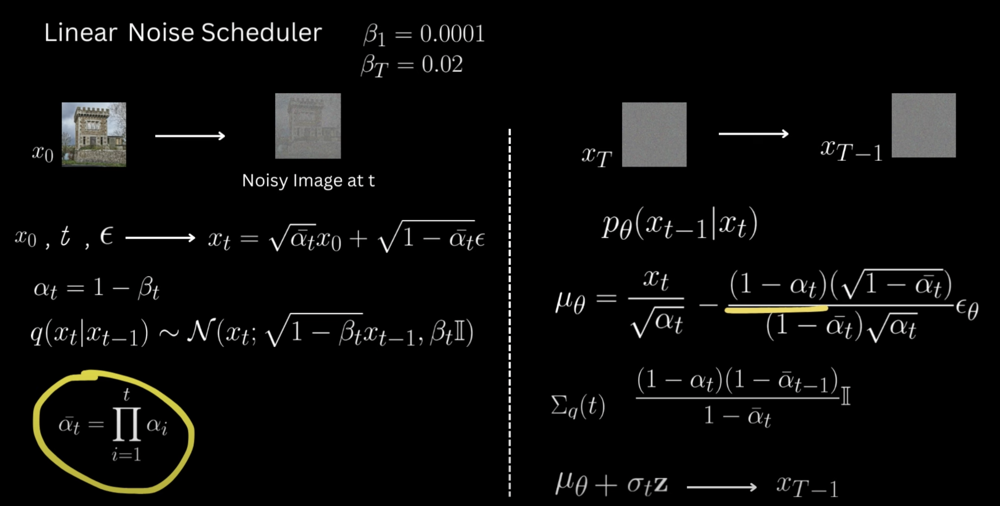
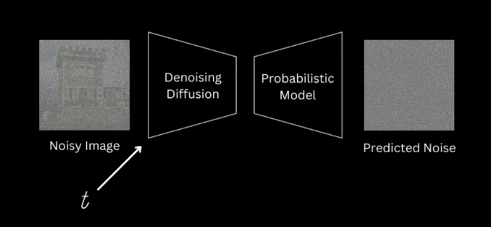
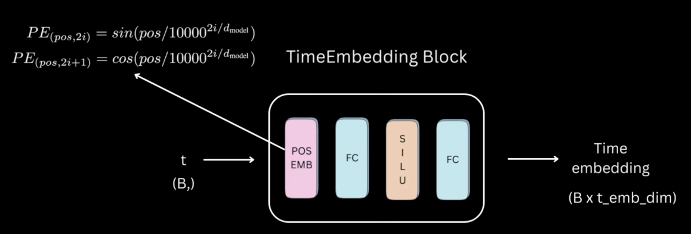
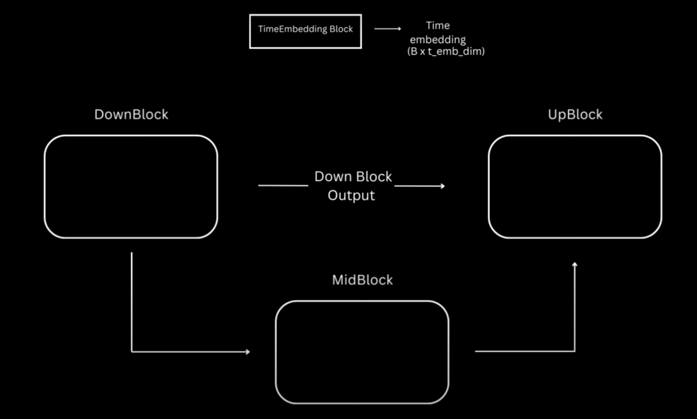
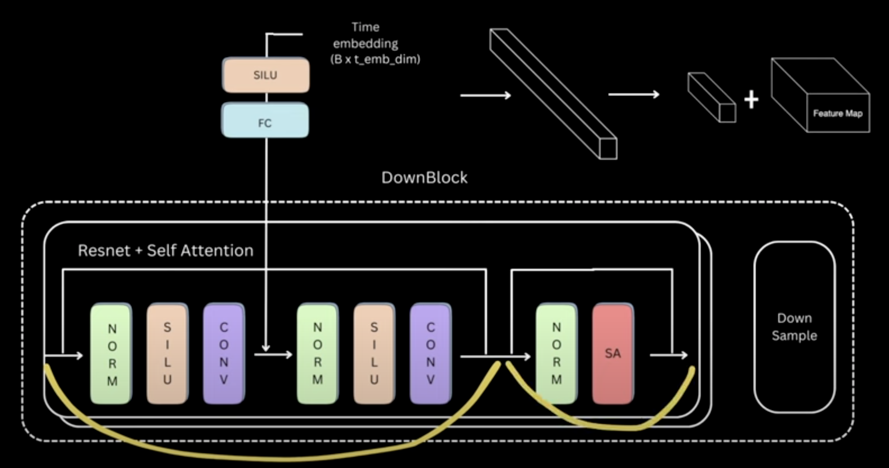
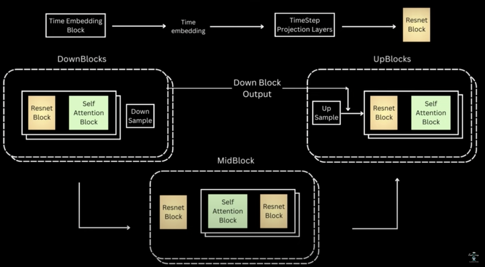

### Linear Noise Scheduler Components

#### Forward Process
- Given `x0, t, epsilon` => We can get the `xt` as shown above, at runtime.
- We need to store variables  
    - `sqrt_one_minus_alpha_cumprod`, 
    - `sqrt_alpha_cumprod`
- betas need to be gradually changed
    - Since, from `xt` -> `x{t-1}` during reverse process, we move fast initially , we inject higher noise i.e `say` 0.02
    - Towards `x0`, since, we assume inductively, most of the image is already `denoised`, we move slowly i.e beta = 1e-4
- After solving recurrence, we have a closed form, to get `xt` from `x0`, `t` and `epsilon`, we will have such a method  called `add_noise`

#### Reverse Process
- Solving the inverse-denoising, we get
    - `x0` = ( `xt` - `sqrt_one_minus_alpha_cumprod[t]` * `noise_pred` ) / `sqrt_alpha_cumprod[t]`

- Mean and Variance:-
    - `mean` = `xt`  -  (`1 - alpha_t`) * `noise_pred` / `sqrt_one_minus_alpha_cumprod[t]`
        - `mean` /= `torch.sqrt( alpha_t )`
    - `variance` = `(1 - alpha_t)` * `term`
        - `term` = (`1 - alpha_cumprod_{t-1}`) / (`1 - alpha_cumprod_t`)
    - This method is called `sample_prev_timestep`

### Diffusion Model Components
asdas
> [!NOTE]
> - For Diffusion models, we are free to use any architecture we want, given it satisfies 2 responsibilties:-
> - - `The input.shape` == `output.shape` 
> - - We are able to fuse the `timestep` info.

#### Why to `fuse timestep` info?
- Whether in `training` or in `sampling` phase, the info about `timestep` i.e what timestep, we are at is always available to us.
- Fusing this info, will help the model in `prediction` of the `original noise` at that timestep.

### TimeEmbedding Block

- Projecting timestep for each image in a batch to its emb_dim space 
- For `pos-emb`, they use `sinosuidal` embedding

### Skeleton of UNET

#### Down Block

- `Mid` and `Up` blocks are similar to `Down` Block
- Let's start by understanding `Down` Block
    - Idea: 
        - Downsampling the `spatial dimension`
        - Expanding the `feature dimension`
        - This is done until we compact the info in a `latent` representation space.
    - The Down Block consists of:-
        - Resnet Block
            - 2 Conv Blocks
                - Each `Conv Block` is:-
                    - `(Norm)` => `SiLU` => `Conv2D`
            - After 2 of then in sequence we have a `skip connection`, hence the name
        - Attention Block
            - `Norm` => `Self-Attention` [Why Norm?; similar to LLaMA idea]
            - Then `skip`
    - There are `Nx` of these in sequence.
- Fusing the `timestep` info:-
    - 

#### All Blocks (UNET)
