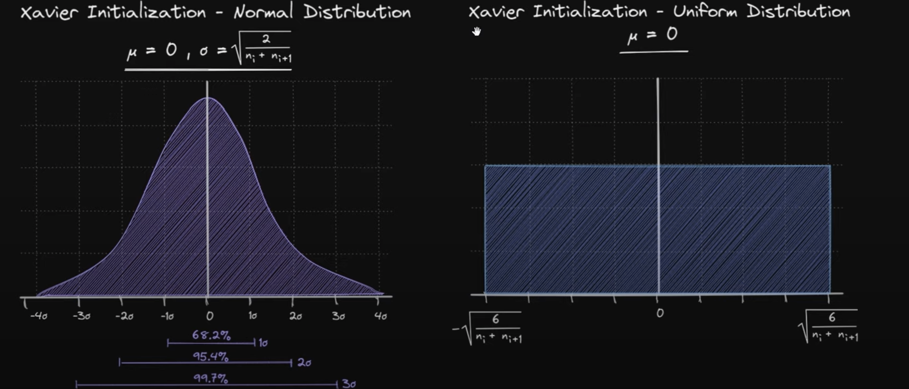
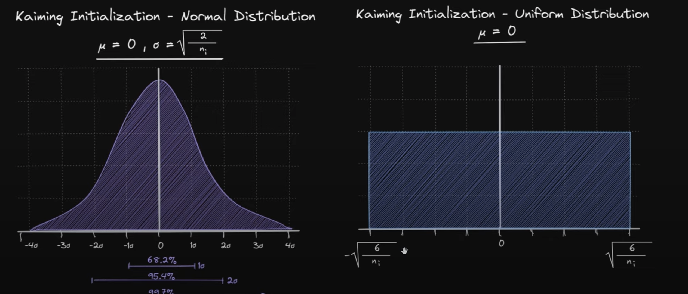

#### Why Weight Init?

- Most of the instabilities in training emanate from `high variance` in input-weight distribution
    - These are `vanishing` and `exploding` grads problems.
    - There are other numerical instabilities, that hinder the process of traiining making it slow.
    - Also, smooth gradient flow during training
    - Hence, there's a need to init weights. But from where?
        - Need for distributions that have `low variance`

#### Glorot Init
- Recall: 2 Hands balancing weights (2 Hands for `fan_in`, `fan_out`)
##### Viz

- Has 2 forms: Normal and Uniform
- Both work fine, practically
- For Normal:-
    - `mu`: 0
    - `std`: (recall needs to be small) -> sqrt(2/ {`fan_in + fan_out`} )
- For Uniform:-
    - `alpha`: sqrt( 6/{`fan_in + fan_out`}  )
    - `beta`:  - sqrt( 6/{`fan_in + fan_out`}  )

##### Scenarios
- Used in `non-ReLU` activation functions like `tanh` etc
- Balcnces the spread as a function of both `fan_in` and `fan_out`

#### He Init
- Recall: 1 Hand with all the load (Just `fan_in`)
##### Viz

- Has 2 forms: Normal and Uniform
- Both work fine, practically
- For Normal:-
    - `mu`: 0
    - `std`: (recall needs to be small) -> sqrt(2/ {`fan_in`} )
- For Uniform:-
    - `alpha`: sqrt( 6/{`fan_in`}  )
    - `beta`:  - sqrt( 6/{`fan_in`}  )
##### Scenarios
- Used in dying neurons setting i.e ReLU and variants `ReLU-like`
- Since, on an avg, half of the neurons will die (`neg ones`), depends only on `input`