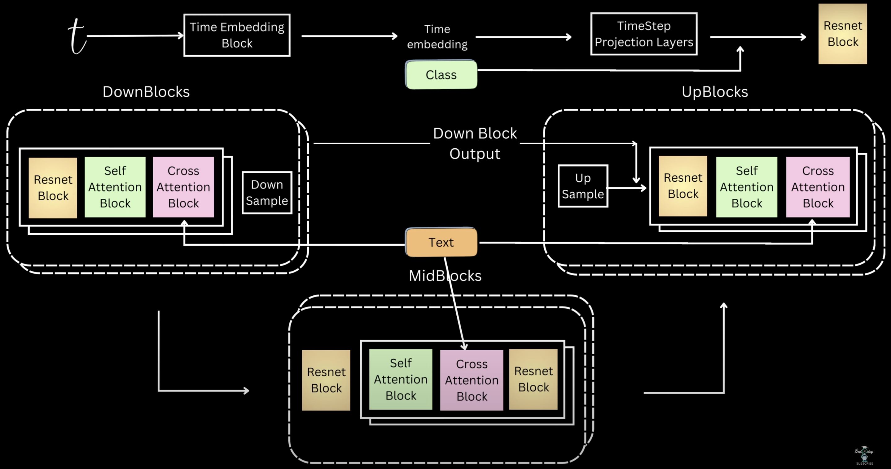
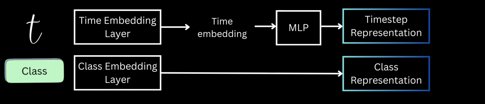

### Block Diagram

- `timestep` repr:-
    - The timestep info, is fed to the `sinosuidal` embedding, which in turn will be fed to `linear layers` and we end up getting the `timestep` representation.
    - This `timestep` repr. is fed to all `Resnet` Blocks i.e `down`, `mid` and `up`.
- `text` repr:-  
    - The `text` i.e `prompt` also called the `controlling signal` is converted to `text repr` after it was fed to a `text encoder`.
    - This `text repr` is attended by  all the `Cross Attention Blocks` of `down`, `mid` and `up` blocks.
- `class` repr:-  
    - The `class repr` that we got after passing it to an `embedding` layer was added to `time repr` and fed to all `Resnet` blocks.

#### More on `TimeStep Repr` and `Class Repr`

- For timestep, the authors use, `TimeEmbeddingLayer`, then `MLP`
- For class repr, they used `learnable` `ClassEmbeddingLayer`